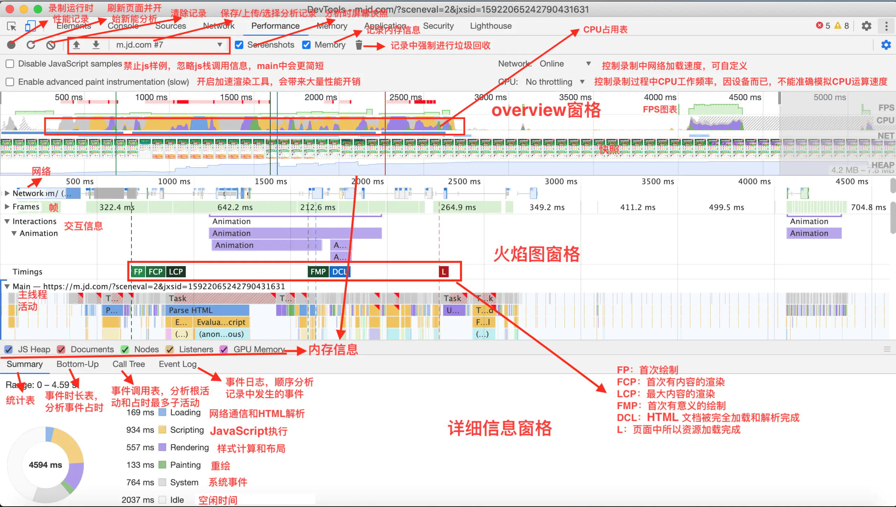
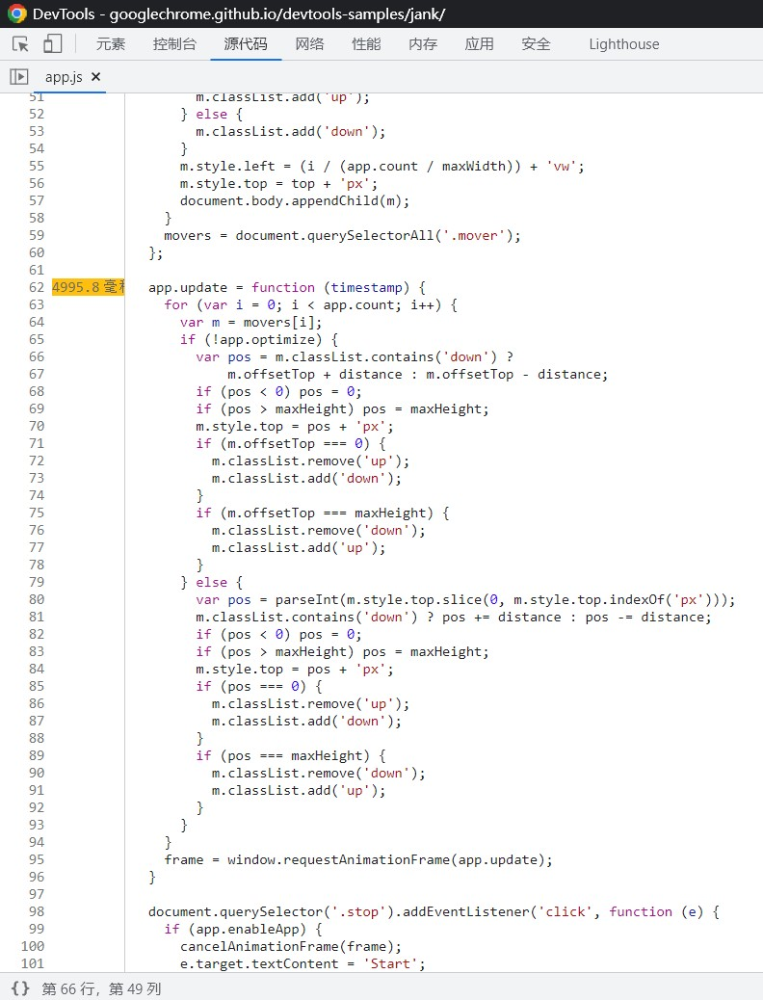

# web 性能优化

## 前言

## 痛点

- **目标不明确：** 只会照本宣科，把别人的优化手段生搬硬套到自己的项目；
- **缺乏量化指标：** 无法评估优化效果，拿不出客观、可量化的指标证明优化效果；
- **没有实质性的改善用户体验：** 只优化了测试环境数据，没有真正的改善用户的主观体验；
- **没有长效化机制：** 无法保证优化效果长期稳定、不出现衰退；
- **不关注开发体验：** 没有认识到开发体验和用户体验的正相关性；

## 性能指标

### RAIL 性能模型

RAIL 是 response （响应）、 animation（动画）、idle（浏览器空置状态）和 load（加载）

#### **Response**

--100ms 即时响应

如果用户点击了一个按钮，你需要保证在用户察觉出延迟之前就得到反馈。无论是表单控制还是执行动画，只要有输入，这个原则都适用。如果没有在合理的时窗内完成响应，也就是 **\*采取动作和得到响应之间出现了断层** ，用户将会察觉到这个延迟。

响应的速度根本上来说取决于输入的延迟，输入的延迟存在于：指甲触到屏幕玻璃和实际像素到达屏幕之间。你有没有过这样的经历：轻触到某种东西，结果它没有给出任何反应，接着你就会质疑自己那个东西是否真的接收到你的轻触。这种自我怀疑的场景就是我们想要避免的！

响应的主要交互是：

- **tapping（轻触）** – 当用户轻触或者点击一个按钮或者图标时（比如，轻触菜单图标打开一个抽屉导航）。

要得到响应式的回应，我们需要：

- 在首次收到输入时，在 100 毫秒内得到回应。
- 理想情况下，收到的回应就是最终结果。但如果最终结果还需要花更长的时间得到，那也要给用户一个“加载中”的标识，或是颜色的变更，告诉用户“本产品已经接收到了指令，还在处理中”，不至于让用户自我怀疑

#### Animation

--16.6ms 动画流畅

动画现在是应用的一大支柱，从滚动到视图变化，都有动画的身影。我们要明确在这段时间里能做些什么，因为用户可能常常是直接操作，帧率的改变很容易被察觉到。但是用户想要的只是流畅的响应而已。

动画包含了以下概念：

- **视觉动画**
  这个包括了动画的开始和退出，状态改变时的动画，还有加载标识。
- **滚动**
  当用户开始滚动页面，页面出现猛动的情况。
- **拖拽**
  当我们需要对用户的拖拽交互在 100 毫秒以内做出响应时，比如平移地图或者缩放屏幕时，我们需要依赖动画。

要合理地动画，每一帧动画要 **在 16 毫秒内完成** ，才能达到 60FPS（1000ms/60 ~= 16.6 ms）。

#### **IDLE**

--合理利用空闲时加载

要制作响应迅速动画精良的应用通常需要比较长的工时。Optimistic UI 模式利用这个技术达到了很好的效果。并非所有工作都要在 response 阶段或者 load 阶段完成：评论引导、组件初始化、数据检索和排序和分析数据的送都不是需要立刻传达给用户的，所以可以在浏览器空闲的时候再处理这些任务。

要想合理地应用浏览器空闲时间，最好把时间以 50 毫秒为单位分组。为什么要这么做呢？在上文里也提到的，用户做出动作后，应用应该在 100 毫秒内给出响应，不应该出现一个模板渲染 2 秒之久。

#### **LOAD**

--1s 内渲染主要内容

页面加载时间是最常见的性能话题。对用户来说最先看到的内容应该是最有意义、最先被加载出来的。接着页面要持续响应用户，绝对不允许出现在滚动页面、轻触或者看动画的时候卡顿。特别是当多个页面使用同一个线程的时候，要实现这样的目标真的很困难。

想要尽快将页面加载出来，我们需要把最需要传达的内容在 1 秒内渲染出来。超过 1 秒钟，用户的注意力就会被分散，当前执行的任务将有中断感。要达到在 1 秒内渲染完毕的目标，我们要优先考虑关键渲染路径，将所有不需要在加载时处理的任务延迟到浏览器空闲时再处理（或根据需求拦加载）。

#### 性能目标

| Response                             | Animation                                        | Idel                         | Load                                |
| ------------------------------------ | ------------------------------------------------ | ---------------------------- | ----------------------------------- |
| 用户操作触发后<br />100ms 内得到响应 | 每一帧的渲染在<br />16.6ms 内完成                | 合理使用浏览器<br />空闲事件 | 加载的过程要满足<br />“响应”目标    |
|                                      | 拖拽后的页面<br />渲染也要在 <br />16.6ms 内完成 | 每个任务在<br />50ms 内完成  | 最重要的内容要在<br />1s 内完成加载 |

### Google Web 性能指标（web vitals）

Web Vitals 是由 Google 提出的一组用于衡量 Web 页面体验质量的指标。

#### Performance 常见名词



1. FP（First Paint）首次绘制
2. FCP（First Contentful Paint）首次内容绘制
3. LCP（Largest Contentful Paint）最大内容渲染
4. DCL（DomContentloaded）HTML 文档加载完成
5. FMP（First Meaningful Paint）首次有效绘制
6. L（onLoad）资源全部加载完成

- TTI（Time to Interactive）可交互时间
  指标用于标记应用已进行视觉渲染并能可靠响应用户输入的时间点
- TBT（Total Blocking Time）页面阻塞总时长
  TBT 汇总所有加载过程中阻塞用户操作的时长，在 FCP 和 TTI 之间任何 long task 中阻塞部分都会被汇总
- FID（First Input Delay）首次输入延迟
  指标衡量的是从用户首次与您的网站进行交互（即当他们单击链接，点击按钮等）到浏览器实际能够访问之间的时间
- CLS（Cumulative Layout Shift）累积布局偏移
- SI（Speed Index）可视区域的显示速度, 单位是时间

#### 三大核心指标（Core Web Vitals）

##### Largest Contentful Paint (LCP)

`LCP` 代表了页面的速度指标，虽然还存在其他的一些体现速度的指标，但是上文也说过 `LCP` 能体现的东西更多一些。一是指标实时更新，数据更精确，二是代表着页面最大元素的渲染时间，通常来说页面中最大元素的快速载入能让用户感觉性能还挺好。

###### 决定因素

- `` 标签
- `<image>` 在 svg 中的 image 标签
- `<video>` video 标签
- CSS background url()加载的图片
- 包含内联或文本的块级元素

###### 线上测量工具

- Chrome User Experience Report
- PageSpeed Insights
- Search Console (Core Web Vitals report)
- web-vitals JavaScript library

###### 实验室工具

- Chrome DevTools
- Lighthouse
- WebPageTest

###### 原生的 JS API 测量

LCP 还可以用 JS API 进行测量，主要使用 `PerformanceObserver`接口，目前除了 IE 不支持，其他浏览器基本都支持了。

```javascript
new PerformanceObserver((entryList) => {
  for (const entry of entryList.getEntries()) {
    console.log('LCP candidate:', entry.startTime, entry);
  }
}).observe({ type: 'largest-contentful-paint', buffered: true });
```

###### 优化方向

- 服务端响应时间
- Javascript 和 CSS 引起的渲染卡顿
- 资源加载时间
- 客户端渲染

##### First Input Delay (FID)

`FID` 代表了页面的交互体验指标，毕竟没有一个用户希望触发交互以后页面的反馈很迟缓，交互响应的快会让用户觉得网页挺流畅。

###### 线上测量工具

- Chrome User Experience Report
- PageSpeed Insights
- Search Console (Core Web Vitals report)
- web-vitals JavaScript library

###### 原生的 JS API 测量

```javascript
new PerformanceObserver((entryList) => {
  for (const entry of entryList.getEntries()) {
    const delay = entry.processingStart - entry.startTime;
    console.log('FID candidate:', delay, entry);
  }
}).observe({ type: 'first-input', buffered: true });
```

###### 优化方向

- 减少第三方代码的影响
- 减少 Javascript 的执行时间
- 最小化主线程工作
- 减小请求数量和请求文件大小

##### Cumulative Layout Shift (CLS)

`CLS` 代表了页面的稳定指标，它能衡量页面是否排版稳定。尤其在手机上这个指标更为重要，因为手机屏幕挺小，`CLS`值一大的话会让用户觉得页面体验做的很差。CLS 的分数在 0.1 或以下，则为 Good。

###### 线上测量工具

- Chrome User Experience Report
- PageSpeed Insights
- Search Console (Core Web Vitals report)
- web-vitals JavaScript library

###### **实验室工具**

- Chrome DevTools
- Lighthouse
- WebPageTest

###### 原生的 JS API 测量

```javascript
let cls = 0;
new PerformanceObserver((entryList) => {
  for (const entry of entryList.getEntries()) {
    if (!entry.hadRecentInput) {
      cls += entry.value;
      console.log(‘Current CLS value:’, cls, entry);
    }
  }
}).observe({type: ‘layout-shift’, buffered: true});
```

###### 优化方向

- 图片或视屏元素有大小属性，或者给他们保留一个空间大小，设置 width、height，或者使用 unsized-media feature policy 。
- 不要在一个已存在的元素上面插入内容，除了相应用户输入。
- 使用 animation 或 transition 而不是直接触发布局改变

## 性能测试工具

建议基于浏览器无痕模式测试，保证在一个相对干净的环境下运行。

### Chrome DevTools

### Google PageSpeed Insights（需要魔法）

Google PageSpeed Insights 是一个由 Google 提供的网站性能优化工具。它可以对网页进行分析，评估网页的加载速度和性能，并提供页面优化建议。

#### 功能

1. 页面的加载速度：您将了解该页面的实际加载速度以及如何改进加载速度。
2. 移动设备的适应性：您将了解您的网页在移动设备上的表现情况，并获取可帮助您改善移动设备性能的建议。
3. 最佳实践：该工具会根据 Google 的开发人员文档提供技术建议，以帮助您按照最佳实践优化您的网站。
4. 用户体验：该工具还提供了一些用户体验建议，以帮助您通过改善页面结构和布局来提高用户体验。

#### 使用

[https://developers.google.com/speed/pagespeed/insights/](https://developers.google.com/speed/pagespeed/insights/)

### LightHouse

#### 功能

1. 渲染性能分析：分析何时和如何显示应用程序在用户的屏幕上。
2. 安全：检查应用程序是否存在安全问题，例如未加密的密码字段，恶意 JavaScript 等。
3. 可访问性：检查应用程序是否容易使用，即对残障人士和其他具有特殊需求的用户进行测试，例如无障碍文本、颜色对比度等。
4. 最佳实践：检查应用程序是否遵循 Web 开发的最佳实践，例如使用 HTML5 标准，避免内存泄漏等。
5. 性能：评估应用程序的整体性能，包括页面加载时间、响应时间等。

#### 使用

打开 Developer Tools，并单击“Lighthouse”选项卡

### WebPageTest

#### 功能

1. 评估网站的性能：它测试网站的加载时间、响应时间等，并为每个阶段提供详细信息。
2. 确定性能问题：WebPageTest 可以确定哪些部分的网站需要改进，例如渲染时间、JavaScript 和 CSS 文件等。
3. 测量不同地理位置的性能：WebPageTest 可让您从世界各地的服务器测试您的网站，以便了解不同地理位置的表现如何。
4. 在不同的设备和浏览器上测试：WebPageTest 可以模拟不同的设备和浏览器来测试您的网站的表现。

#### 使用

[https://www.webpagetest.org/](https://www.webpagetest.org/%EF%BC%89%E3%80%82)

### GTmetrix

#### 功能

1. 评估页面加载速度：GTmetrix 测试您的网站的加载速度，并提供一个性能分数和详细报告。
2. 帮助识别性能问题：GTmetrix 会为您确定可能影响网站性能的问题，并提供改进建议。
3. 比较性能数据：GTmetrix 允许您比较多个版本的网站性能数据，以便查看改进是否被有效实现。
4. 监控网站性能：GTmetrix 提供一个监测工具，帮助您随时了解网站性能的变化并提前识别问题。

#### 使用

[https://gtmetrix.com/](https://gtmetrix.com/%EF%BC%89%E3%80%82)

### 性能测量 Apis

console.time、console.timeEnd

### 弱网环境测试

## 性能分析

性能问题的原因出现在哪个阶段？网络请求、代码漏洞、构建工具

### 网络请求

#### DNS 解析

#### 网络模型

#### TCP 连接

#### HTTP 不同版本的差异

##### HTTP 1.1

HTTP/1.1 中大多数的网站性能优化技术都是减少向服务器发起的 HTTP 请求数。浏览器可以同时建立有限个 TCP 连接，而通过这些连接下载资源是一个线性的流程：一个资源的请求响应返回后，下一个请求才能发送。这被称为线头阻塞。

在 HTTP/1.1 中，Web 开发者往往将整个网站的所有 CSS 都合并到一个文件。类似的，JavaScript 也被压缩到了一个文件，图片被合并到了一张雪碧图上。合并 CSS、JavaScript 和图片极大地减少了 HTTP 的请求数，在 HTTP/1.1 中能获得显著的性能提升。

**存在的问题：**
为了尽可能减少请求数，需要做合并文件、雪碧图、资源内联等优化工作，但是这无疑造成了单个请求内容变大延迟变高的问题，且内嵌的资源不能有效地使用缓存机制。

##### HTTP/2.0 的优势

###### 二进制分帧传输

帧是数据传输的最小单位，以二进制传输代替原本的明文传输，原本的报文消息被划分为更小的数据帧。

原来 Headers + Body 的报文格式如今被拆分成了一个个二进制的帧，用**Headers 帧**存放头部字段，**Data 帧**存放请求体数据。分帧之后，服务器看到的不再是一个个完整的 HTTP 请求报文，而是一堆乱序的二进制帧。这些二进制帧不存在先后关系，因此也就不会排队等待，也就没有了 HTTP 的队头阻塞问题。

###### 多路复用（MultiPlexing）

通信双方都可以给对方发送二进制帧，这种二进制帧的 **双向传输的序列** ，也叫做流(Stream)。HTTP/2 用流来在一个 TCP 连接上来进行多个数据帧的通信，这就是**多路复用**的概念。

在一个 TCP 连接上，我们可以向对方不断发送帧，每帧的 Stream Identifier 标明这一帧属于哪个流，然后在对方接收时，根据 Stream Identifier 拼接每个流的所有帧组成一整块数据。 把 HTTP/1.1 每个请求都当作一个流，那么多个请求变成多个流，请求响应数据分成多个帧，不同流中的帧交错地发送给对方，这就是 HTTP/2 中的多路复用。

流的概念实现了单连接上多请求 - 响应并行，解决了线头阻塞的问题，减少了 TCP 连接数量和 TCP 连接慢启动造成的问题。所以 http2 对于同一域名只需要创建一个连接，而不是像 http/1.1 那样创建 6~8 个连接

###### 服务端推送（Server Push）

在 HTTP/2 当中，服务器已经不再是完全被动地接收请求，响应请求，它也能新建 stream 来给客户端发送消息，当 TCP 连接建立之后，比如浏览器请求一个 HTML 文件，服务器就可以在返回 HTML 的基础上，将 HTML 中引用到的其他资源文件一起返回给客户端，减少客户端的等待。

Server-Push 主要是针对资源内联做出的优化，相较于 http/1.1 资源内联的优势:

- 客户端可以缓存推送的资源
- 客户端可以拒收推送过来的资源
- 推送资源可以由不同页面共享
- 服务器可以按照优先级推送资源

###### Header 压缩（HPACK）

使用 HPACK 算法来压缩首部内容

#### 资源加载方式和速度

### 代码漏洞

#### 关键渲染路径（Critical Rendering Path）

指的是浏览器将 HTML、CSS 和 JavaScript 转换为用户可以看到的网页的过程。这个过程中，浏览器必须依次完成一系列步骤，包括处理 HTML DOM 树和 CSS 样式计算，生成渲染树，布局计算和最后的绘制。而关键渲染路径就是这些步骤中对性能影响最大的部分。

### 构建工具

### 总结

1. 首先我们可以使用 Lighthouse，在本地进行测量，根据报告给出的一些建议进行优化；
2. 发布之后，我们可以使用 PageSpeed Insights 去看下线上的性能情况；
3. 接着，我们可以使用 Chrome User Experience Report API 去捞取线上过去 28 天的数据；
4. 发现数据有异常，我们可以使用 DevTools 工具进行具体代码定位分析；
5. 使用 Search Console’s Core Web Vitals report 查看网站功能整体情况；
6. 使用 Web Vitals 扩展方便的看页面核心指标情况；

## 优化方案

### 图片资源优化

#### webpack 图片压缩

**安装**

```bash
npm i -D image-webpack-loader
```

**添加配置**

```javascript
module: {
  rules: [
    {
      test: /\.(png|jpe?g|gif|svg)(\?.*)?$/,
      use: [
        {
          loader: 'file-loader',
          options: {
            name: '[name]_[hash].[ext]',
            outputPath: 'images/',
          },
        },
        {
          loader: 'image-webpack-loader',
          options: {
            // 压缩 jpeg 的配置
            mozjpeg: {
              progressive: true,
              quality: 65,
            },
            // 使用 imagemin**-optipng 压缩 png，enable: false 为关闭
            optipng: {
              enabled: false,
            },
            // 使用 imagemin-pngquant 压缩 png
            pngquant: {
              quality: '65-90',
              speed: 4,
            },
            // 压缩 gif 的配置
            gifsicle: {
              interlaced: false,
            },
            // 开启 webp，会把 jpg 和 png 图片压缩为 webp 格式
            webp: {
              quality: 75,
            },
          },
        },
      ],
    },
  ];
}
// ...
```

#### 使用雪碧图

雪碧图的作用就是减少请求数，而且多张图片合在一起后的体积会少于多张图片的体积总和，这也是比较通用的图片压缩方案

#### 图片懒加载

在页面中，先不给图片设置路径，只有当图片出现在浏览器的可视区域时，才去加载真正的图片，这就是延迟加载。对于图片很多的网站来说，一次性加载全部图片，会对用户体验造成很大的影响，所以需要使用图片延迟加载。

#### 使用 CSS3 代替图片

有很多图片使用 CSS 效果（渐变、阴影等）就能画出来，这种情况选择 CSS3 效果更好。因为代码大小通常是图片大小的几分之一甚至几十分之一。

#### 使用 webp 格式的图片

`WebP` 是 Google 团队开发的加快图片加载速度的图片格式，其优势体现在它具有更优的图像数据压缩算法，能带来更小的图片体积，而且拥有肉眼识别无差异的图像质量；同时具备了无损和有损的压缩模式、Alpha 透明以及动画的特性，在 JPEG 和 PNG 上的转化效果都相当优秀、稳定和统一。

### 使用 HTTP2.0

HTTP/2 的优化需要不同的思维方式。Web 开发者应该专注于网站的 **缓存调优** ，而不是担心如何减少 HTTP 请求数。通用的法则是， **传输轻量、细粒度的资源** ，以便独立缓存和并行传输。


###### 停止合并文件

在 HTTP/2 中合并文件不再是一项最佳实践。虽然合并依然可以提高压缩率，但它带来了代价高昂的缓存失效。即使有一行 CSS 改变了，浏览器也会强制重新加载你 _所有的_ CSS 声明。

另外，你的网站不是所有页面都使用了合并后的 CSS 或 JavaScript 文件中的全部声明或函数。被缓存之后倒没什么关系，但这意味着在用户第一次访问时这些不必要的字节被传输、处理、执行了。HTTP/1.1 中请求的开销使得这种权衡是值得的，而在 HTTP/2 中这实际上减慢了页面的首次绘制。

Web 开发者应该更加专注于缓存策略优化，而不是压缩文件。将经常改动和不怎么改动的文件分离开来，就可以尽可能利用 CDN 或者用户浏览器缓存中已有的内容。

###### 停止内联资源

内联资源是文件合并的一个特例。它指的是将 CSS 样式表、外部的 JavaScript 文件和图片直接嵌入 HTML 页面中。

###### 停止细分域名

细分域名是让浏览器建立更多 TCP 连接的通常手段。浏览器限制了单个服务器的连接数量，但是通过将网站上的资源切分到几个域上，你可以获得额外的 TCP 连接。它避免了线头阻塞，但也带来了显著的代价。

细分域名在 HTTP/2 中应该避免。每个细分的域名都会带来额外的 DNS 查询、TCP 连接和 TLS 握手（假设服务器使用不同的 TLS 证书）。在 HTTP/1.1 中，这个开销通过资源的并行下载得到了补偿。但在 HTTP/2 中就不是这样了：多路复用使得多个资源可以在一个连接中并行下载。同时，类似于资源内联，域名细分破坏了 HTTP/2 的流优先级，因为浏览器不能跨域比较优先级。

### 开启 gzip 压缩

#### Webpack 配置

**下载插件**

```bash
npm install compression-webpack-plugin —-save-dev
npm install compression
```

**添加配置**

```javascript
const CompressionPlugin = require(‘compression-webpack-plugin’);

module.exports = {
  plugins: [new CompressionPlugin()],
}
```

#### Nodejs 配置

**下载插件**

```bash
npm install compression —save
```

**添加配置**

```javascript
var compression = require('compression');
var app = express();
app.use(compression());
```

#### Nginx 配置

```nginx
gzip  on;
gzip_min_length 1k;
gzip_buffers 4 16k;
gzip_comp_level 6;
gzip_types text/plain text/css text/xml application/javascript application/x-javascript application/xml application/json;
gzip_vary on;
gzip_disable "MSIE [1-6]\.";
```

重启服务生效

### Webpack 优化-文件哈希

Webpack 给我们提供了三种哈希值计算方式，分别是 `hash`、`chunkhash`和 `contenthash`。那么这三者有什么区别呢？

- `hash`：跟整个项目的构建相关，构建生成的文件 hash 值都是一样的，只要项目里有文件更改，整个项目构建的 hash 值都会更改。
- `chunkhash`：根据不同的入口文件(Entry)进行依赖文件解析、构建对应的 chunk，生成对应的 hash 值。
- `contenthash`：由文件内容产生的 hash 值，内容不同产生的 `contenthash`值也不一样。
  显然，我们是不会使用第一种的。改了一个文件，打包之后，其他文件的 `hash`都变了，缓存自然都失效了。这不是我们想要的。

那 `chunkhash`和 `contenthash`的主要应用场景是什么呢？在实际在项目中，我们一般会把项目中的 CSS 都抽离出对应的 CSS 文件来加以引用。如果我们使用 `chunkhash`，当我们改了 CSS 代码之后，会发现 CSS 文件 `hash`值改变的同时，JS 文件的 `hash`值也会改变。这时候，`contenthash`就派上用场了。

### 代码优化-减少回流重绘

以 Goolgle Devtools 官方案例说明



```javascript
// 获取offsetTop（不推荐）
const offsetTop = Dom.offsetTop;

// 获取offsetTop（推荐）
const offsetTop = parseInt(Dom.style.top);
```

### 代码优化-降低 CSS 选择器复杂度

浏览器读取选择器，遵循的原则是从选择器的右边到左边读取。看个示例：

```css
#block .text p {
  color: red;
}
```

1. 查找所有 P 元素。
2. 查找结果 1 中的元素是否有类名为 text 的父元素
3. 查找结果 2 中的元素是否有 id 为 block 的父元素

CSS 选择器优先级

```
内联 > ID选择器 > 类选择器 > 标签选择器
```

根据以上两个信息可以得出结论：

1. 减少嵌套。后代选择器的开销是最高的，因此我们应该尽量将选择器的深度降到最低（最高不要超过三层），尽可能使用类来关联每一个标签元素
2. 关注可以通过继承实现的属性，避免重复匹配重复定义
3. 尽量使用高优先级的选择器，例如 ID 和类选择器。
4. 避免使用通配符，只对需要用到的元素进行选择

### 分阶段加载

当一个 UI 界面需要渲染的内容过多加载速度较慢，但是为了响应用户操作提升用户体验，可分阶段加载。如：loading--->骨架图-->文本内容-->图片/视频

## 性能监控工具

### 流水线预监控

- Lighthouse CI 或 PageSpeed Insights API ：把 Lighthouse 或 PageSpeed Insights API 集成到 CI 流水线中，输出报告分析
- Puppeteer 或 Playwright ：使用 E2E 自动化测试工具集成到流水线模拟用户操作，得到 Chrome Trace Files，也就是我们平常录制 Performance 后，点击左上角下载的文件。Puppeteer 和 Playwright 底层都是基于 Chrome DevTools Protocol
- Chrome Trace Files：根据规则分析 Trace 文件，可以得到每个函数执行的时间。如果函数执行时间超过了一个临界值，可以抛出异常。如果一个函数每次的执行时间都超过了临界值，那么就值得注意了。但是还有一点需要思考的是：函数执行的时间是否超过临界值固然重要，但更重要的是这是不是用户的输入响应函数，与用户体验是否有关
- 输出报告。定义异常临界值。如果异常过多，考虑是否卡发布流程。

## 参考

https://web.dev/learn-core-web-vitals/

https://developer.chrome.com/docs

https://zhuanlan.zhihu.com/p/20276064（RAIL性能模型）

https://www.zhihu.com/question/385397882/answer/3019091966（前言、痛点）

https://blog.csdn.net/c_kite/article/details/104237256（Performance常见名词）

https://segmentfault.com/a/1190000041753539
